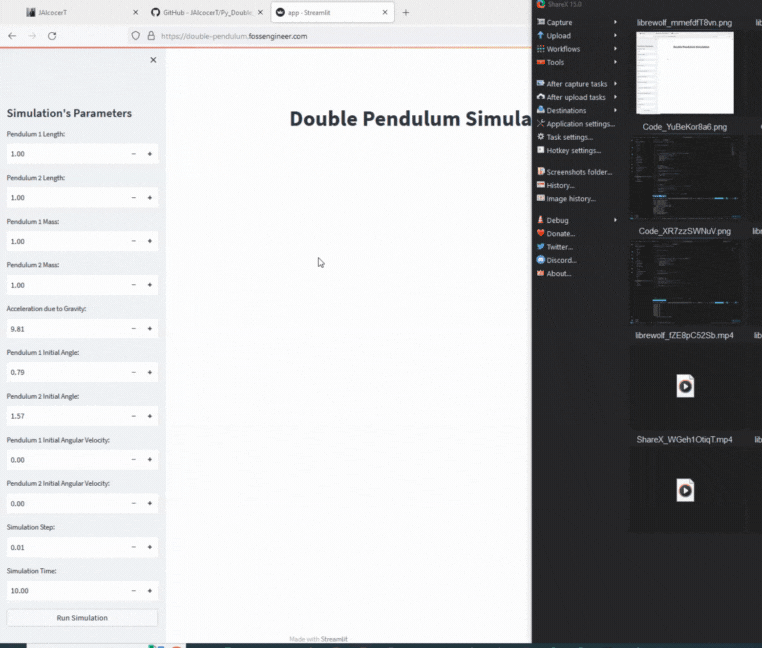

# Py_Double_Pendulum

Understanding **Chaos Theory** with a simulation of a **Double Pendulum with Python** and Streamlit. Observe how deterministic and yet chaotic systems behave.

My **goal** with this project, open to everyone, irrespective of one's grounding in science, mathematics or IT skills  is more than just creating an interactive digital simulation of a Double Pendulum. 

Here, we are not merely observing the erratic dance of the Double Pendulum but we are invited into a deeper realm of contemplation.

This particular Double Pendulum example can serve as a mirror, prompting us to recognize the parallels between the pendulum's unpredictable swings and the intricate web of events and decisions that shape our lives. In every unexpected twist of the pendulum, there's a reflection of life's unforeseen turns, of choices that lead to vastly different outcomes, and of tiny events that cascade into monumental changes.

*In the dance of the Double Pendulum, **as in life**, the smallest shift can lead to the wildest of changes.*

* Deployed at: <https://double-pendulum.fossengineer.com>
    * The Docker Images are ready at [DockerHub x86/ARM](https://hub.docker.com/r/fossengineer/double_pendulum)
* Further Description at: 
    *  The post on my Tech Blog: <https://fossengineer.com/chaos-theory-and-the-double-pendulum-with-python/>
    *  [Medium Post](https://medium.com/@jalcocert/python-dance-with-chaos-simulating-the-double-pendulum-d45e622da207)

## Powered Thanks To :heart:

* [Plotly](https://github.com/plotly/plotly.py)
* [Streamlit](https://github.com/streamlit/streamlit)
* Physics

## :loudspeaker: Ways to Contribute 

Please feel free to fork the code - try it out for yourself and improve or add others graphs/features.

* Support the [Projects](https://github.com/JAlcocerT/Py_Double_Pendulum#powered-thanks-to-heart) that made possible this App, thanks to their fantastic job, this have been possible.

* Support extra evening code sessions:

## :scroll: License

    This program is free software; you can redistribute it and/or modify
    it under the terms of the GNU General Public License (GPL) version 3.0:

    Freedom to use: You can use the software for any purpose, without any restrictions.
    Freedom to study and modify: You can examine the source code, learn from it, and modify it to suit your needs.
    Freedom to share: You can share the original software or your modified versions with others, so they can benefit from it too.
    Copyleft: When you distribute the software or any derivative works, you must do so under the same GPL-3.0 license. This ensures that the software and its derivatives remain free and open-source.

    This program is distributed in the hope that it will be useful, but WITHOUT ANY WARRANTY.